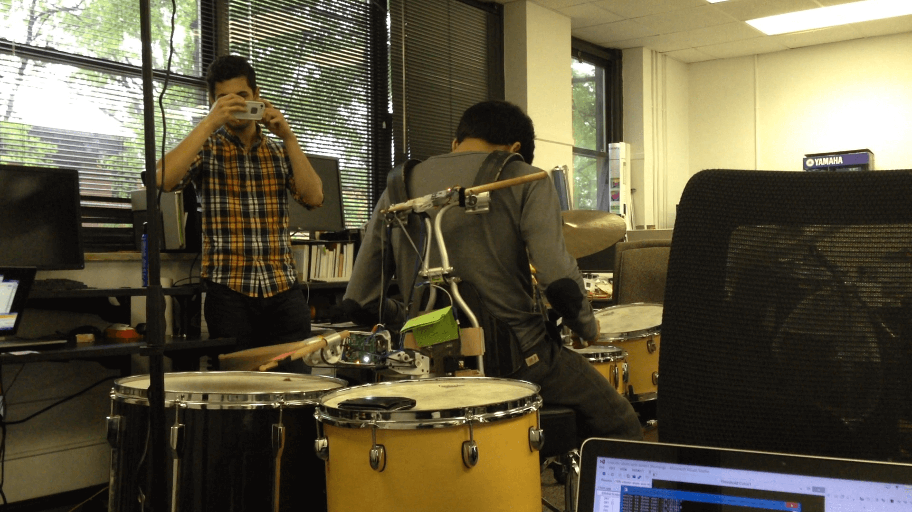

# Robotic Drumming Arm Kinect App
This C++ Visual Studio project is part of an experimental control system for a robotic drumming arm. 

The image below is of the back-mounted drumming arm in action.

The pole on the left site of the image is holding up a Kinect camera that is pointed directly down at the drums. When this program is run, the user is first presented with a still from the Kinect video feed and asked to click on the drums. Then, using the colored tags (red tab on one of the drum sticks and green paper at the base on the drummer's back), the angle to each drum is calculated. These angles are sent to a central control unit (not part of this repository) that moves the arm to hit the drum that is currently being targeted.

Requires OpenNI2 and OpenCV2.
